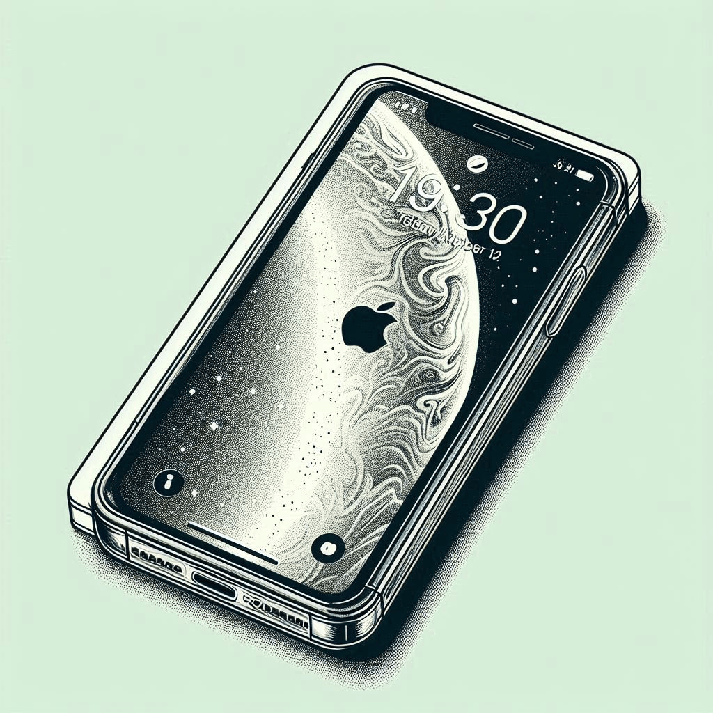

-------

# Projeto EBOOK Gerado por I.A.s

 > ℹ️ **NOTE:** 

EBOOK voltado para usuários de iPhone com dicas de utilização para facilitar o dia a dia. 

## 💻 Tecnologias utilizadas no projeto

- [ChatGPT](https://chat.openai.com/) 
- [Microsoft Designer](https://designer.microsoft.com/home)
- [PowerPoint](https://www.microsoft.com/en/microsoft-365/powerpoint)

## 🧠 Prompts

ChatGPT：

|   Ação   | prompt                                                                                                                                                                                                                                                                         |
| :------: | ------------------------------------------------------------------------------------------------------------------------------------------------------------------------------------------------------------------------------------------------------------------------------ |
|  título  | Crie um titulo de ebook sobre o tema de dicas e truques para utilizar o celular iPhone, o título deve ser curto, com linguagem simples.                      | conteúdo | Faça um texto para ebook, onde iremos oferecer dicas e truques para utilização do celular iPhone.
Nos temas abordados não pode faltar dicas sobre como:
* melhorar a vida da bateria
* Qual a melhor opção para tirar foto noturna 
* utilizar aplicativo medidas
* utilizar o aplicativo saúde
* Acessibilidade de movimentos quando estiver no veículo
* Inclusão de aniversário aos contatos
* utilização do whathsapp
{REGRAS}
>Explique sempre de maneira simples e fácil entendimento
>Deixe o texto enxuto
>sempre deixe um título sugestivo para o tópico

Microsoft Designer：

|  Ação  | prompt                                                                                 |
| :----: | -------------------------------------------------------------------------------------- |
| título | Imagem para capa do meu ebook de dicas para mexer no iphone, que seja no estilo desenho, que tenha uma imagem do celular Iphone com símbolo da Apple e seja clean. |

## ✨ Features

- Conteúdo gerado via ChatGPT
- Imagens geradas via MidJourney

## 📚 Materiais

- Imagens utilizadas em `assets`
- ebook gerado durante as aulas em `output`

---

⌨️ com 💜 por [Felipe Aguiar](https://github.com/felipeAguiarCode)
